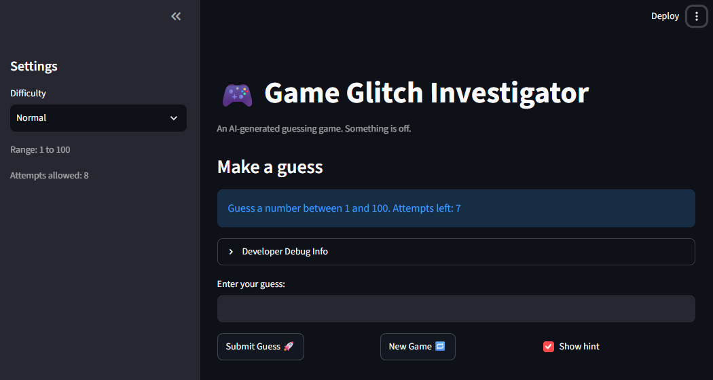
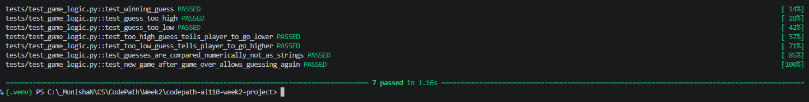

# 🎮 Game Glitch Investigator: The Impossible Guesser

## 🚨 The Situation

You asked an AI to build a simple "Number Guessing Game" using Streamlit.
It wrote the code, ran away, and now the game is unplayable. 

- You can't win.
- The hints lie to you.
- The secret number seems to have commitment issues.

## 🛠️ Setup

1. Install dependencies: `pip install -r requirements.txt`
2. Run the broken app: `python -m streamlit run app.py`

## 🕵️‍♂️ Your Mission

1. **Play the game.** Open the "Developer Debug Info" tab in the app to see the secret number. Try to win.
2. **Find the State Bug.** Why does the secret number change every time you click "Submit"? Ask ChatGPT: *"How do I keep a variable from resetting in Streamlit when I click a button?"*
3. **Fix the Logic.** The hints ("Higher/Lower") are wrong. Fix them.
4. **Refactor & Test.** - Move the logic into `logic_utils.py`.
   - Run `pytest` in your terminal.
   - Keep fixing until all tests pass!

## 📝 Document Your Experience

- Game's purpose is to create a fun and repetitive guessing game simulation
- The higher and lower hints weren't functioning as expected and the new game button didn't create a new session (didn't allow user input).
- I swapped the reversed hint messages, made guesses always compare as numbers instead of sometimes as strings, and made New Game reset the status, history and secret so you can keep playing.

## 📸 Demo Walkthrough

Describe your fixed game in numbered steps so a reader can follow along without watching a video:

1. Enter a value in 'Enter your guess:' input box
2. Hit submit guess
3. Read the hint that pops up beneath the submission 
4. Congrats if you won! Try a harder level by changing the difficulty in the settings menu in the top left corner.
5. If not, repeat steps 1-4 until you win or you run out of guesses.
6. Once done with your game, you can start a new game by clicking the 'New Game' button

## 🧪 Test Results

## 🚀 Stretch Features

- [ ] [If you choose to complete Challenge 4, describe the Enhanced UI changes here — a screenshot is optional]
